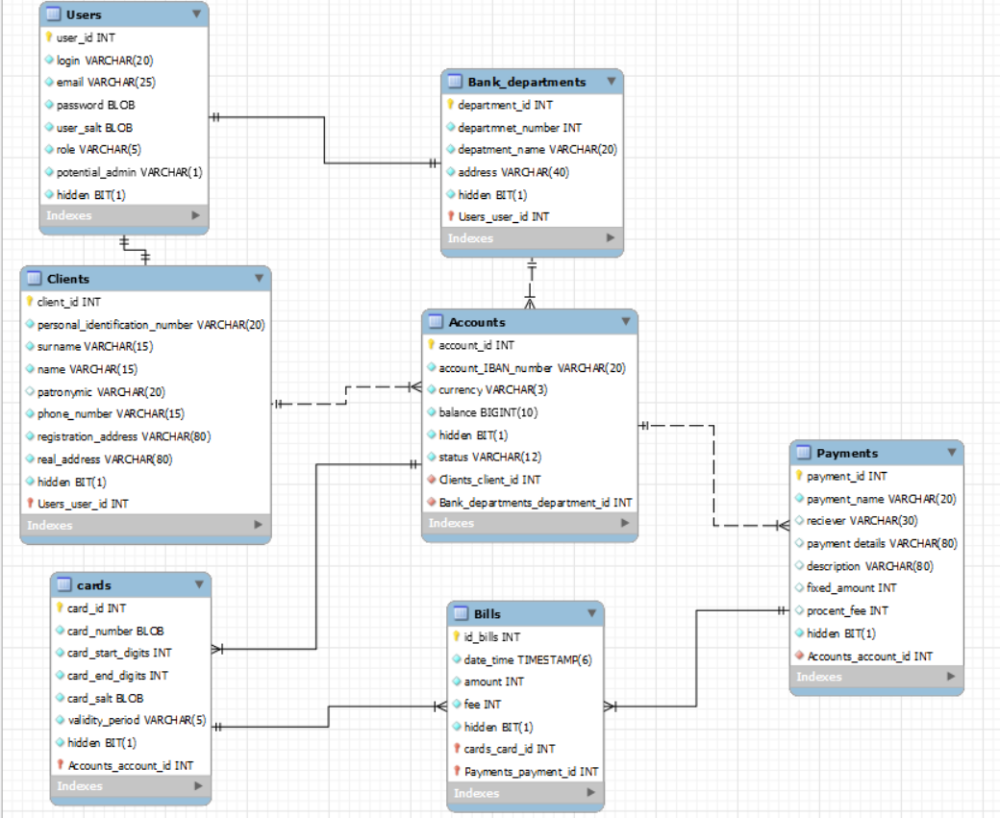

#Payment-Web-Project

Проект не окончен, идет исправление ошибок
Присутствует 2 роли:
- Клиент
- Банк (Администратор)

Система **Платежи**. **Клиент** имеет одну или несколько **Кредитных карт**, каждая из которых соответстует некоторому **Счету** в системе платежей. **Клиент** может при помощи **Счета** сделать **Платеж**, заблокировать **Счет** и пополнить **Счет**. **Администратор** снимет блокировку.

